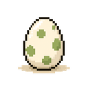
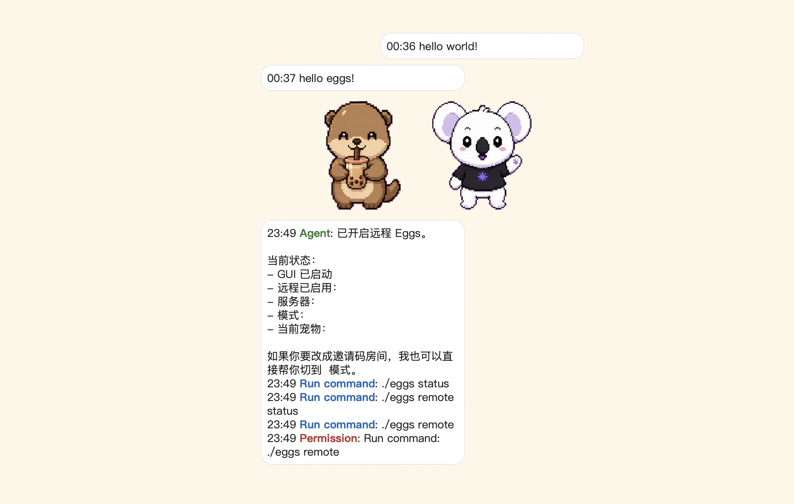

<p align="center">
  
</p>

<h1 align="center">Eggs</h1>

<p align="center">Multi-user desktop pet</p>

## Features

- Multiple pets — Compatible with Codex pet packs.
- Custom pet states — Define arbitrary states per pet.
- Multiplayer remote sessions — Sync pet status and chat with peers.
- Agent hooks — Render local hook events as pet bubbles.
- Skills — Built-in compatibility with the community Skills ecosystem.
- Plugins — Claude Code and Codex plugin packages with built-in hook bubbles for prompts, tool calls, permissions, and stop events.

<p align="center">
  
</p>

## Install as a Skill (Agent-Managed)

If you drive Eggs through Claude Code, Codex, or another agent that supports the community Skills ecosystem, install it as a skill and let the agent run the commands for you:

```bash
npx skills add larchliu/eggs
```

That drops the `eggs` skill into your agent's skills directory. The skill ships a tiny launcher (`./eggs` on macOS/Linux, `eggs.cmd` on Windows) — on first use it downloads the right prebuilt binary into `~/.eggs/bin/` and caches it. No Rust toolchain, Python, or local build required.

From then on, ask the agent in plain language and it will map the request to the skill's CLI:

| You say                                  | Agent runs                       |
| ---------------------------------------- | -------------------------------- |
| `/eggs` or "spawn the desktop pet"       | `./eggs start`                   |
| "stop eggs" / "kill the pet"             | `./eggs stop`                    |
| "is eggs running?"                       | `./eggs status`                  |
| "switch eggs to waving"                  | `./eggs state waving`            |
| "use local kebo"                         | `./eggs pet local kebo`          |
| "join remote random match"               | `./eggs remote`                  |
| "join remote room ABC123"                | `./eggs remote room ABC123`      |
| "leave the remote room"                  | `./eggs remote leave`            |

`./eggs start` and `./eggs restart` must run unsandboxed (the GUI has to reach WindowServer / X / Wayland); in Claude Code that means `dangerouslyDisableSandbox: true` on the launching Bash call. Pure state mutations (`state`, `pet`, `remote`, `install`, `stop`, `status`) are safe to run sandboxed.

See [eggs/SKILL.md](eggs/SKILL.md) for the full surface the agent has access to.

## Install as a Plugin (Hooks-Enabled)

The skill-only install lets an agent *drive* Eggs on demand. The plugin install goes one step further: it also wires up **hooks** so that prompt submissions, tool calls, permission requests, and stop events from the agent automatically show up as pet bubbles on the desktop — no manual prompting required.

Two plugin packages ship from this repo:

- [claude-plugin/](claude-plugin/) — Claude Code plugin (`SessionStart`, `UserPromptSubmit`, `Notification`, `PreToolUse` matcher per tool, `Stop`, `SubagentStop`)
- [codex-plugins/](codex-plugins/) — Codex plugin (`UserPromptSubmit`, `PostToolUse`, `PermissionRequest`, `Stop`)

Both plugins bundle the full `eggs` skill internally, so installing the plugin gives you both the agent-driven CLI surface **and** the live hook bubbles.

### Claude Code

The repo ships a Claude marketplace manifest at [.claude-plugin/marketplace.json](.claude-plugin/marketplace.json). Inside a Claude Code session:

```
/plugin marketplace add larchliu/eggs
/plugin install eggs@eggs
```

Restart the session if prompted. After install:

- `/eggs` launches the desktop companion via the bundled skill.
- Hook events fire automatically — every `UserPromptSubmit`, `PreToolUse` (Bash / Read / Write|Edit / Grep|Glob / WebSearch / WebFetch / `mcp__*`), `Notification`, `Stop`, and `SubagentStop` is rendered as a bubble by [claude-plugin/hooks/eggs-claude-notify.js](claude-plugin/hooks/eggs-claude-notify.js).
- Hook commands resolve via `${CLAUDE_PLUGIN_ROOT}`, so the install path is portable.

To remove: `/plugin uninstall eggs@eggs` (and `/plugin marketplace remove eggs` if you also want to drop the marketplace entry).

### Codex

The Codex plugin manifest lives at [codex-plugins/.codex-plugin/plugin.json](codex-plugins/.codex-plugin/plugin.json), exposed via the marketplace at [.agents/plugins/marketplace.json](.agents/plugins/marketplace.json) with `installation: AVAILABLE`.

1. Add the marketplace from your shell:

   ```bash
   codex plugin marketplace add larchliu/eggs
   ```

2. Launch Codex by running `codex` in your terminal.

3. Inside Codex, open the plugin browser:

   ```
   /plugins
   ```

4. Pick the **Eggs** marketplace, then the **Eggs** plugin, and confirm install.

After install:

- The bundled skill exposes the same `$eggs` natural-language surface.
- [codex-plugins/hooks/hooks.json](codex-plugins/hooks/hooks.json) wires `UserPromptSubmit`, `PostToolUse` (matcher `.*`), `PermissionRequest`, and `Stop` to [codex-plugins/hooks/eggs-codex-notify.js](codex-plugins/hooks/eggs-codex-notify.js), each emitting a `eggs hook "<text>"` bubble.

To remove, reopen `/plugins` and uninstall from the same UI. Run `codex plugin marketplace remove eggs` if you also want to drop the marketplace entry.

> **Heads-up — Codex 0.130.0+ hook regression.** Codex's hook dispatch is being reworked. On 0.130.0 and 0.131.0-alpha.4 the lifecycle event still fires (`hook: SessionStart Completed` appears in stderr) but the configured command is **never invoked** — no side-effect files, no `additionalContext` reaching the model. This is consistent with the new trust UX: project-level hooks appear to require an interactive TUI trust prompt that headless `codex exec` sessions can't surface. 0.128.0 still works end-to-end. Until the trust workflow stabilises, pin to **`codex@0.128.0`** if you need the Eggs hook bubbles in CI / wrapper tools. Upstream tracking: [openai/codex#21639](https://github.com/openai/codex/issues/21639). The skill-only install path above is unaffected — only hook-driven bubbles are.

### Requirements & Caveats

- Node.js must be on `$PATH` — both hook scripts are plain `node` invocations with no extra dependencies.
- The hook scripts shell out to the cached `eggs` binary, so the desktop companion must be runnable (`./eggs start` or `eggs start` from `$PATH`). The plugin's bundled skill handles the first-time download.
- Hooks only render bubbles when a GUI is already running. The plugin does **not** auto-start the companion on `SessionStart` — call `/eggs` once per session (or run `eggs start` from your shell) to bring it up.
- Hook scripts must run unsandboxed only if they themselves invoke `eggs start`. Pure bubble-emit calls (`eggs hook "..."`) are file-driven and safe under sandboxed Bash.

## Quick Start (Build From Source)

Build and run the desktop binary:

```bash
./desktop/dev fast
./desktop/src-tauri/target/release-fast/eggs
```

Or run through wrapper helpers:

```bash
./desktop/dev run
./desktop/dev run remote
```

Common helper targets:

```bash
./desktop/dev fast
./desktop/dev release
./desktop/dev check
./desktop/dev clean
./desktop/dev test
```

## CLI (Desktop Binary)

The same binary is both GUI and CLI:

```bash
eggs
eggs run
eggs start
eggs stop
eggs restart
eggs status
eggs list
eggs pet <source> <id>
eggs state <name>
eggs install <pet-dir>
eggs hook "<text>"
eggs message "<text>"
eggs remote help
eggs uninstall-cli
```

Notes:

- `eggs start` launches detached and writes PID to `~/.eggs/eggs.pid`.
- CLI mutations are file-driven (`state.json` / `remote.json`) and picked up by the running GUI via polling + single-instance forwarding.
- First GUI launch from packaged builds attempts best-effort CLI install into PATH (platform-specific).

## Remote Multiplayer

Remote state is stored in `~/.eggs/remote.json` and defaults to:

- `server_url`: `http://localhost:8787`
- `mode`: `random`
- `room_limit`: `5`

Key commands:

```bash
eggs remote
eggs remote random
eggs remote room <code> [limit]
eggs remote leave
eggs remote off
eggs remote server <url>
eggs remote status
eggs remote upload [pet_id]
```

Behavior highlights:

- `remote` and `remote on` keep the saved mode/room.
- `remote room <code> [limit]` persists invite room mode and cap.
- `remote random` switches mode without clearing saved room code.
- Pet switch in remote mode gates local change on successful upload to keep local/peer view consistent.
- `eggs pet <source> <id>` targets an exact pet source: `builtin`, `local`, or `remote`.
- Upload is source-aware (`pet_source + pet`) while peer downloads are content-addressed by `content_id` from server-provided asset URLs.
- The detailed upload/download protocol is documented in `desktop/README.md` under `Remote Asset Flow`.

## Codex Hook Integration

See [`## Install as a Plugin (Hooks-Enabled) → Codex`](#codex) above for the recommended path. The Codex plugin bundles the same hook scripts and registers them automatically.

## Data Directory

Runtime data is in `~/.eggs/` (or `EGGS_APP_DIR` override):

- `state.json`: current pet, pet source, state, scale, window position
- `client.json`: device identity
- `remote.json`: remote config
- `eggs.pid`: detached GUI pid
- `pets/<id>/`: installed pets
- `remote/`: cached peer sprite assets and blobs
- `bubble-spool/`: queued local bubble events

Pet lookup priority:

1. `EGGS_PETS_DIR` (if set, exclusive)
2. `~/.eggs/pets`
3. `$CODEX_HOME/pets` or `~/.codex/pets`
4. Remote cache under `~/.eggs/remote`

## Pet Asset Format

Each pet folder:

```text
<pet-id>/
  pet.json
  spritesheet.webp  # or png
```

`pet.json` fields used by desktop runtime:

- `id`
- `displayName`
- `description` (optional)
- `spritesheetPath`

## Custom Atlas Builder

If you already have 9 horizontal strip images for custom pet states, you can turn them into `192x208` frames and compose a Codex-style `8x9` atlas with:

```bash
uv run --with pillow python scripts/build_custom_pet_atlas.py \
  --input-dir /absolute/path/to/custom-strips \
  --output-dir /absolute/path/to/custom-build
```

Input expectations:

- `--input-dir` must contain exactly 9 strip images.
- Supported formats are `png`, `webp`, `jpg`, and `jpeg`.
- The script assumes a chroma-key background and uses `#FF00FF` by default.
- Rows are ordered by filename sort order, so name the files in the row order you want.
- Each detected frame is centered into a `192x208` cell, and unused cells in the `8x9` atlas remain transparent.

Optional chroma-key override:

```bash
uv run --with pillow python scripts/build_custom_pet_atlas.py \
  --input-dir /absolute/path/to/custom-strips \
  --output-dir /absolute/path/to/custom-build \
  --chroma-key '#00FF00'
```

Outputs written under `--output-dir`:

- `spritesheet.png`
- `spritesheet.webp`
- `contact-sheet.png`
- `custom-frames-manifest.json`
- `frames/<state>/<index>.png`

## Remote Server

Go server lives in `server/`:

```bash
cd server
go build -o eggs-server .
./eggs-server -addr :8787 -data ./data -base-url http://localhost:8787
```

It uses pure-Go SQLite (`modernc.org/sqlite`) and does not require system SQLite shared libraries on target hosts.

## Packaging

For app bundles:

```bash
cd desktop/src-tauri
cargo tauri build
```

Outputs are under `desktop/src-tauri/target/release/bundle/` (`.dmg`, `.msi`, `.deb`, `.AppImage`, etc, depending on platform/toolchain).

## Repository Layout

```text
desktop/         Tauri app (GUI + CLI binary)
server/          Go remote backend
eggs/            Skill assets, scripts, tools, compatibility wrappers
claude-plugin/   Claude Code plugin package (bundled skill + hooks)
codex-plugins/   Codex plugin package (bundled skill + hooks)
.claude-plugin/  Claude Code marketplace manifest
.agents/         Codex marketplace manifest
assets/          Source art and helper assets
scripts/         Release helpers
```

## Legacy Notes

- `eggs/scripts/egg_desktop.py` remains useful for compatibility and tooling, but feature development is centered on `desktop/src-tauri`.
- Existing legacy `state.json` fields like `sprite` are still accepted by the desktop runtime (`sprite` aliases to `pet`).

[linux.do](https://linux.do)
